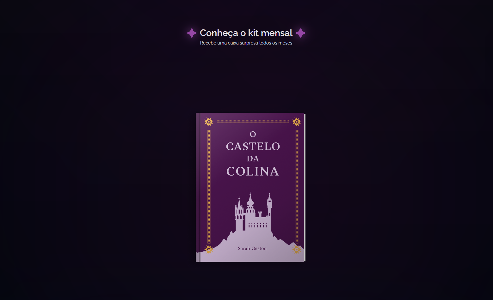
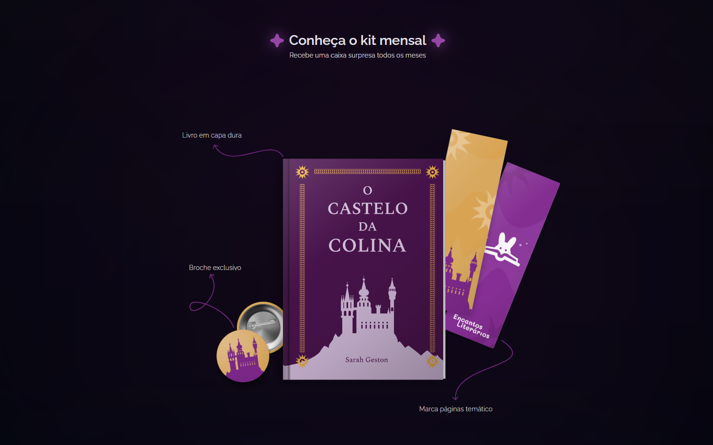
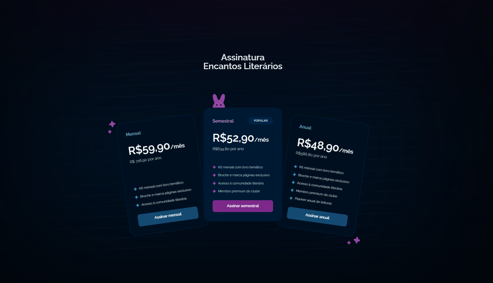

<h1 align="center">📓Landing Page – Clube de Assinatura🐰</h1>

Este projeto foi desenvolvido como parte de um desafio prático, com o objetivo de criar uma landing page para um clube de assinatura. A proposta é apresentar de forma clara e atrativa os benefícios do serviço, com foco em conversão e experiência do usuário.

🎯 Objetivo

Criar uma página inicial que destaque o valor do clube de assinatura, apresente os planos disponíveis, depoimentos de clientes e uma chamada para ação eficaz, utilizando princípios de design responsivo.

🧩 Seções da Página

  - **Hero**: título de impacto e botão de assinatura
  - **Sobre o Clube**: explicação breve sobre o funcionamento do serviço
  - **Planos**: tabela com os diferentes tipos de planos disponíveis
  - **Depoimentos**: feedback de clientes satisfeitos
  - **Chamada final para ação**: convite para se inscrever

## 🎨 Layout

O layout do projeto está disponível no [Figma](https://www.figma.com/design/ckg4WZEwM9bgr1SM5ApNox/LP-de-produto-(Community)-(Copy)?node-id=3-376&p=f&t=KKubJGmidOrfDLeE-0)

    
  
  
  

## 🚀 Tecnologias

Esse projeto foi desenvolvido com as seguintes tecnologias:

- HTML e CSS
- Git e Github
- Figma

## 🚀 Pré-requisitos

Antes de começar, você vai precisar ter instalado em sua máquina as seguinte ferramenta:

📝 Desafio
Desafio proposto por meio do Notion:
🔗 [Link para o desafio](https://efficient-sloth-d85.notion.site/Desafio-pr-tico-LP-clube-de-assinatura-44d75840f9274bcf93ec47cf29cb461b#95799a0e54d74102a92488e874a2a643)

Feito com ♥ by [Gelzieny](https://gelzieny-portfolio.vercel.app/)
